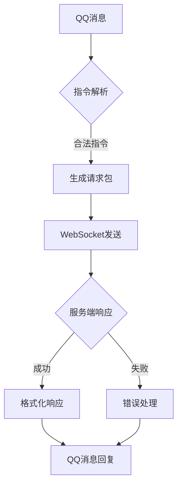

# HuHoBot 机器人客户端

[](https://www.python.org/)
[](https://opensource.org/licenses/GPL-3.0)

基于QQ官方Bot框架的Minecraft服务管理机器人，实现WebSocket协议的双向通信桥梁。

## 核心能力

### 功能特性
- **双向通信**：通过WebSocket与服务端保持长连接
- **权限管理**：多层级管理员系统
- **消息模板**：支持文本/图片混合消息格式
- **异步处理**：基于asyncio的事件循环模型
- **会话管理**：UUID匹配请求响应

### 主要功能
- 白名单添加/删除/查询
- 服务器状态监控
- 游戏内命令执行
- MOTD服务器状态查询
- 服务器绑定管理
- 自定义扩展指令

## 技术架构



## 快速入门

### 环境要求
- Python 3.9+
- 依赖库：`pip install -r requirements.txt`
- QQ开放平台应用

### 安装运行
```bash
# 克隆仓库
git clone https://github.com/HuHoBot/Bot.git

# 安装依赖
pip install -r requirements.txt

# 启动机器人
python index.py
```

### 启动帮助
```commandline
python index.py --help
```

## 配置说明

### 核心配置
```json5
{
  "AppId": "1000", // QQ机器人APPID
  "Secret": "secret", // QQ机器人密钥
  "Audit": false, // 是否已通过审核
  "WsKey": "secret", // WebSocket密钥
  "BotName": "HuHoBot", // 机器人名称
  "WsUrl": "ws://127.0.0.1:25671", // WebSocket地址
  "UrlGetIframeImg": "http://127.0.0.1:3123/api/sync_app_img?host={SERVERHOST}&dark=true&stype={PLATFORM}&icon=https%3A%2F%2Fpic.txssb.cn%2FHuHoBot-200px.png", // 获取图片
  "UrlDefaultImg": "https://pic.txssb.cn/HuHoBot-200px.png", // 默认图片地址
  "MotdOriginUrl": "motd.txssb.cn", // MOTD服务地址（源）
  "MotdProxyUrl": "http://127.0.0.1:2087", // MOTD服务地址（代理）（留空不替换）
  "GenerateImgUrl": "http://127.0.0.1:2087/{IMGID}.png", // 图片生成服务地址
  "TtfPath": "MapleMono-CN-Regular.ttf", // 图片生成字体路径
  "PublicGroup": [], // 公开群组ID（/在线服务器 展示连接到WS主控的服务器数量）
  "EnableMotd": true, // 是否启用MOTD
  "EnableAuth": true, // 是否启用认证
  "EnableSensitiveFilter": true // 是否启用敏感词过滤
}

```

### 服务监控
- 自动心跳检测（15秒间隔）
- 断线自动重连（3秒重试）
- 请求超时自动清理

## License
GPL-3.0 License © 2026 HuHoBot

